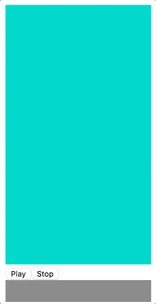

![Built With Stencil](https://img.shields.io/badge/-Built%20With%20Stencil-16161d.svg?logo=data%3Aimage%2Fsvg%2Bxml%3Bbase64%2CPD94bWwgdmVyc2lvbj0iMS4wIiBlbmNvZGluZz0idXRmLTgiPz4KPCEtLSBHZW5lcmF0b3I6IEFkb2JlIElsbHVzdHJhdG9yIDE5LjIuMSwgU1ZHIEV4cG9ydCBQbHVnLUluIC4gU1ZHIFZlcnNpb246IDYuMDAgQnVpbGQgMCkgIC0tPgo8c3ZnIHZlcnNpb249IjEuMSIgaWQ9IkxheWVyXzEiIHhtbG5zPSJodHRwOi8vd3d3LnczLm9yZy8yMDAwL3N2ZyIgeG1sbnM6eGxpbms9Imh0dHA6Ly93d3cudzMub3JnLzE5OTkveGxpbmsiIHg9IjBweCIgeT0iMHB4IgoJIHZpZXdCb3g9IjAgMCA1MTIgNTEyIiBzdHlsZT0iZW5hYmxlLWJhY2tncm91bmQ6bmV3IDAgMCA1MTIgNTEyOyIgeG1sOnNwYWNlPSJwcmVzZXJ2ZSI%2BCjxzdHlsZSB0eXBlPSJ0ZXh0L2NzcyI%2BCgkuc3Qwe2ZpbGw6I0ZGRkZGRjt9Cjwvc3R5bGU%2BCjxwYXRoIGNsYXNzPSJzdDAiIGQ9Ik00MjQuNywzNzMuOWMwLDM3LjYtNTUuMSw2OC42LTkyLjcsNjguNkgxODAuNGMtMzcuOSwwLTkyLjctMzAuNy05Mi43LTY4LjZ2LTMuNmgzMzYuOVYzNzMuOXoiLz4KPHBhdGggY2xhc3M9InN0MCIgZD0iTTQyNC43LDI5Mi4xSDE4MC40Yy0zNy42LDAtOTIuNy0zMS05Mi43LTY4LjZ2LTMuNkgzMzJjMzcuNiwwLDkyLjcsMzEsOTIuNyw2OC42VjI5Mi4xeiIvPgo8cGF0aCBjbGFzcz0ic3QwIiBkPSJNNDI0LjcsMTQxLjdIODcuN3YtMy42YzAtMzcuNiw1NC44LTY4LjYsOTIuNy02OC42SDMzMmMzNy45LDAsOTIuNywzMC43LDkyLjcsNjguNlYxNDEuN3oiLz4KPC9zdmc%2BCg%3D%3D&colorA=16161d&style=flat-square)

# Lottie Animation Web Component

This is a dead simple [lottie](https://github.com/airbnb/lottie-web) animation web component, compiled with Stencil.

```html
<lottie-animation src="./assets/lottie_logo.json" autoplay loop controls></lottie-animation>
<script src='https://unpkg.com/lottie-wc/dist/lottie.js'></script>
```

It's intentionally minimal design so that you can apply your own design language to this. 



## Using this component

### Script tag

- [Publish to NPM](https://docs.npmjs.com/getting-started/publishing-npm-packages)
- Put a script tag similar to this `<script src='https://unpkg.com/lottie-wc/dist/lottie.js'></script>` in the head of your index.html
- Then you can use the element anywhere in your template, JSX, html etc

### Node Modules
- Run `npm install lottie-wc --save`
- Put a script tag similar to this `<script src='node_modules/lottie-wc/dist/lottie.js'></script>` in the head of your index.html
- Then you can use the element anywhere in your template, JSX, html etc

### In a stencil-starter app
- Run `npm install lottie-wc --save`
- Add `{ name: 'lottie-wc' }` to your [collections](https://github.com/ionic-team/stencil-starter/blob/master/stencil.config.js#L5)
- Then you can use the element anywhere in your template, JSX, html etc


## Developing

To start building a new web component using Stencil, clone this repo to a new directory:

```bash
git clone https://github.com/splitinfinities/lottie-wc.git lottie-wc
cd lottie-wc
git remote rm origin
```

and run:

```bash
npm install
npm start
```

To watch for file changes during develop, run:

```bash
npm run dev
```

To build the component for production, run:

```bash
npm run build
```

To run the unit tests for the components, run:

```bash
npm test
```

Need help? Check out our docs [here](https://stenciljs.com/docs/my-first-component).
